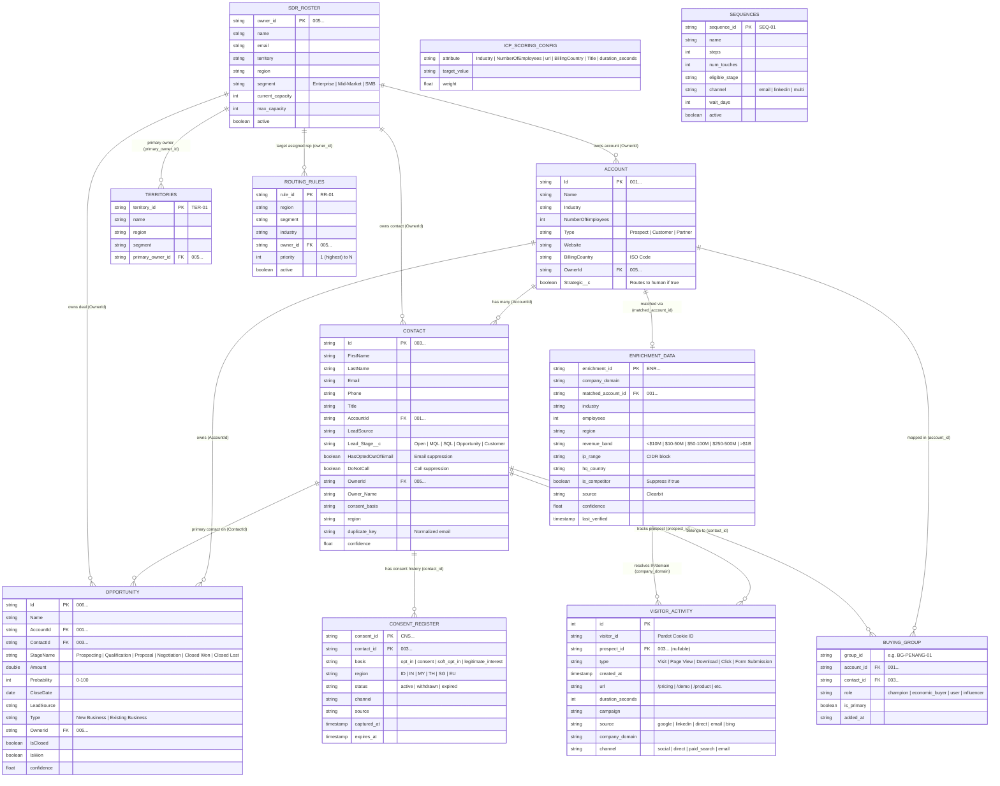
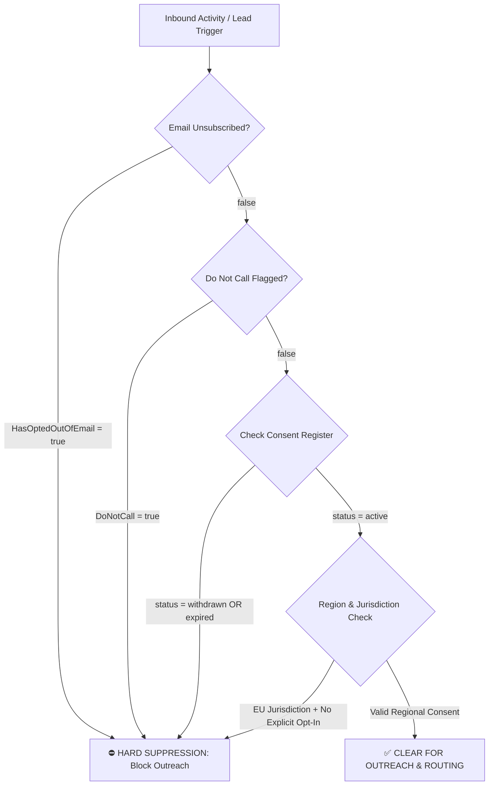

# 📊 Sales Intelligence Data Schema & Data Architecture Guide

> **Dataset:** Autopilot Asia — Sales Intelligence (Inbound Revenue Capture) Enterprise Export (Round 2)  
> **System of Origin:** Salesforce CRM + Pardot (Salesforce Account Engagement)  
> **Identifier Standards:** 18-character Salesforce IDs (`001` Account, `003` Contact, `005` User/Owner, `006` Opportunity)

---

## 📑 Executive Summary

This data package powers the **Sales Intelligence & Inbound Revenue Capture** multi-agent system. It models an enterprise B2B sales pipeline operating across Asia-Pacific (APAC) and Europe (EU), handling everything from digital web engagement to complex account-based sales, buying group assembly, capacity-aware rep routing, and multi-jurisdictional compliance enforcement.

### Data Architecture Categorization

The dataset contains 13 relational tables organized into 4 functional classes:

```
                          ┌─────────────────────────────────────────┐
                          │            SALES DATA ECOSYSTEM         │
                          └────────────────────┬────────────────────┘
                                               │
      ┌────────────────────────┬───────────────┴───────────────┬────────────────────────┐
      │                        │                               │                        │
┌─────▼──────┐          ┌──────▼──────┐                 ┌──────▼──────┐          ┌──────▼──────┐
│   MASTER   │          │TRANSACTIONAL│                 │   CONFIG    │          │  REFERENCE  │
├────────────┤          ├─────────────┤                 ├─────────────┤          ├─────────────┤
│ Account    │          │ Visitor-    │                 │ ICP_Scoring_│          │ Enrichment_ │
│ Contact    │          │  Activity   │                 │  Config     │          │  Data       │
│ Buying_    │          │ Opportunity │                 │ Territories │          │ Consent_    │
│  Group     │          │             │                 │ Routing_    │          │  Register   │
│            │          │             │                 │  Rules      │          │ SDR_Roster  │
│            │          │             │                 │ Sequences   │          │             │
└────────────┘          └─────────────┘                 └─────────────┘          └─────────────┘
```

---

## 📐 Entity Relationship Diagram (ERD)



---

## 🗂️ Detailed Data Dictionary & Schema Definitions

### 1. `Account.csv` (Master)
Represents target enterprise companies and organizations in the CRM.
* **`Id`** (`VARCHAR(18)`): Primary Key. Salesforce 18-character Account ID starting with `001` (e.g. `001uOiJaJkJat7CrhI`).
* **`Name`** (`VARCHAR(255)`): Company legal name (e.g., *Northgate Instruments*, *Zenith Office Solutions*).
* **`Industry`** (`VARCHAR(100)`): Operating industry sector (e.g., `Chemicals`, `Manufacturing`, `Logistics`, `Technology`, `Retail`).
* **`NumberOfEmployees`** (`INTEGER`): Company total employee count.
* **`Type`** (`VARCHAR(50)`): Account status (`Prospect`, `Customer`, `Partner`).
* **`Website`** (`VARCHAR(255)`): Corporate domain (e.g., `northgate.com`).
* **`BillingCountry`** (`VARCHAR(2)`): ISO 2-letter country code (`MY`, `SG`, `IN`, `TH`, `ID`, etc.).
* **`OwnerId`** (`VARCHAR(18)`): Foreign Key to `SDR_Roster.owner_id` (`005...`).
* **`Strategic__c`** (`BOOLEAN`): Custom Salesforce flag. When `true`, indicates a strategic key account requiring human rep routing.

### 2. `Contact.csv` (Master)
Individual business contacts associated with Accounts.
* **`Id`** (`VARCHAR(18)`): Primary Key. Salesforce 18-character Contact ID starting with `003`.
* **`FirstName`** / **`LastName`** (`VARCHAR(100)`): Contact name components.
* **`Email`** (`VARCHAR(255)`): Business email address.
* **`Phone`** (`VARCHAR(50)`): Contact phone number.
* **`Title`** (`VARCHAR(100)`): Job title/role (e.g., `Analyst`, `VP Finance`, `Procurement Lead`, `IT Manager`, `Head of Ops`).
* **`AccountId`** (`VARCHAR(18)`): Foreign Key to `Account.Id`.
* **`LeadSource`** (`VARCHAR(100)`): Intake source (`Pricing Page`, `Referral`, `Trade Show`, `Web`, `Webinar`, `Content`).
* **`Lead_Stage__c`** (`VARCHAR(50)`): Pipeline progression (`Open`, `MQL`, `SQL`, `Opportunity`, `Customer`).  
  > ⚠️ *Note:* `Lead_Stage__c = 'Opportunity'` indicates the contact already has an active deal in the pipeline.
* **`HasOptedOutOfEmail`** (`BOOLEAN`): Hard email suppression flag (`true` = unsubscribed).
* **`DoNotCall`** (`BOOLEAN`): Hard call suppression flag (`true` = do not call).
* **`OwnerId`** (`VARCHAR(18)`): Assigned rep ID (`005...`).
* **`Owner_Name`** (`VARCHAR(100)`): Representative name (e.g., *Wei Ho*, *Mei Chen*).
* **`consent_basis`** (`VARCHAR(50)`): Primary legal consent ground (`opt_in`, `consent`, `soft_opt_in`).
* **`region`** (`VARCHAR(2)`): Jurisdiction ISO country code governing data processing compliance.
* **`duplicate_key`** (`VARCHAR(255)`): Normalized email representation (e.g. `lenancube@highland.com`) used for deduplication across lead sources.
* **`confidence`** (`FLOAT`): Contact data quality confidence score (0.00 – 1.00).

### 3. `Opportunity.csv` (Transactional)
Sales deals and revenue pipeline records.
* **`Id`** (`VARCHAR(18)`): Primary Key. Salesforce Opportunity ID starting with `006`.
* **`Name`** (`VARCHAR(255)`): Deal name (e.g., *Northern Wire & Cable - Expansion*).
* **`AccountId`** (`VARCHAR(18)`): Foreign Key to `Account.Id`.
* **`ContactId`** (`VARCHAR(18)`): Foreign Key to `Contact.Id`.
* **`StageName`** (`VARCHAR(50)`): Deal stage (`Prospecting`, `Qualification`, `Proposal`, `Negotiation`, `Closed Won`, `Closed Lost`).
* **`Amount`** (`NUMERIC(12,2)`): Financial value of opportunity.
* **`Probability`** (`INTEGER`): Close probability percentage (0 – 100).
* **`CloseDate`** (`DATE`): Projected target close date.
* **`LeadSource`** (`VARCHAR(100)`): Channel origin of deal.
* **`Type`** (`VARCHAR(50)`): `New Business` vs `Existing Business`.
* **`OwnerId`** (`VARCHAR(18)`): Foreign Key to `SDR_Roster.owner_id`.
* **`IsClosed`** / **`IsWon`** (`BOOLEAN`): Deal status flags.
* **`confidence`** (`FLOAT`): Deal scoring confidence score.

### 4. `VisitorActivity.csv` (Transactional - Pardot Log)
Digital touchpoints, page views, and interactions captured on company web properties.
* **`id`** (`INTEGER`): Primary Key activity log record ID (e.g., `880000`).
* **`visitor_id`** (`VARCHAR(50)`): Pardot tracking cookie ID. Repeat `visitor_id`s represent multi-touch visitor journeys.
* **`prospect_id`** (`VARCHAR(18)`): Foreign Key to `Contact.Id` (`003...`).  
  > ⚠️ *Note:* Blank/NULL `prospect_id` indicates an **anonymous visitor**.
* **`type`** (`VARCHAR(50)`): Engagement event type (`Visit`, `Page View`, `Download`, `Click`, `Form Submission`).
* **`created_at`** (`TIMESTAMP`): Interaction timestamp (supports multiple date string formats).
* **`url`** (`VARCHAR(255)`): Web asset path (`/pricing`, `/demo`, `/case-studies`, `/product`, `/contact`, `/blog/agentic-ai`).
* **`duration_seconds`** (`INTEGER`): Time spent on page. High dwell time (>300s) on commercial pages signals high intent.
* **`campaign`** (`VARCHAR(100)`): Marketing campaign context (`Q3 Launch`, `Webinar Series`, `Always-On Search`, `Newsletter`).
* **`source`** (`VARCHAR(50)`): Web referral source (`google`, `linkedin`, `direct`, `email`, `bing`).
* **`company_domain`** (`VARCHAR(255)`): Resolved domain from reverse IP lookup (e.g. `sabah.com`, `straits.com`).
* **`channel`** (`VARCHAR(50)`): Acquisition channel (`social`, `direct`, `paid_search`, `email`).

### 5. `Buying_Group.csv` (Master / Relationship)
Maps contacts into multi-person decision-making buying committees per Account.
* **`group_id`** (`VARCHAR(50)`): Group identifier (e.g., `BG-PENANG-01`, `BG-ZENITH-01`).
* **`account_id`** (`VARCHAR(18)`): Foreign Key to `Account.Id`.
* **`contact_id`** (`VARCHAR(18)`): Foreign Key to `Contact.Id`.
* **`role`** (`VARCHAR(50)`): Organizational decision role (`champion`, `economic_buyer`, `user`, `influencer`).
* **`is_primary`** (`BOOLEAN`): Flags the primary group champion.
* **`added_at`** (`VARCHAR(50)`): Date contact joined the buying group.

### 6. `Consent_Register.csv` (Reference / Compliance)
Audit log of legal data processing consent per contact under privacy legislation (GDPR, PDPA, DPDP).
* **`consent_id`** (`VARCHAR(50)`): Primary Key (e.g. `CNSdVeJ8Myfzqlp`).
* **`contact_id`** (`VARCHAR(18)`): Foreign Key to `Contact.Id`.
* **`basis`** (`VARCHAR(50)`): Legal processing ground (`opt_in`, `consent`, `soft_opt_in`, `legitimate_interest`).
* **`region`** (`VARCHAR(2)`): Jurisdiction ISO code (`MY`, `SG`, `IN`, `TH`, `ID`, `EU`).
* **`status`** (`VARCHAR(50)`): Active consent state (`active`, `withdrawn`, `expired`).
* **`channel`** / **`source`** (`VARCHAR(100)`): Intake pathway (e.g., `web_form`, `intake_form`).
* **`captured_at`** / **`expires_at`** (`TIMESTAMP`): Effective validity dates.

### 7. `Enrichment_Data.csv` (Reference / Firmographics)
Enriched corporate intelligence and reverse IP resolution data (from Clearbit).
* **`enrichment_id`** (`VARCHAR(50)`): Primary Key (e.g. `ENRs2Bm2e51ZE8R`).
* **`company_domain`** (`VARCHAR(255)`): Corporate domain (`northgate.com`, `penang-semi.com`).
* **`matched_account_id`** (`VARCHAR(18)`): Foreign Key resolving domain to `Account.Id`.
* **`industry`** / **`employees`** / **`revenue_band`**: Firmographic attributes.
* **`ip_range`** (`VARCHAR(50)`): Subnet CIDR block (e.g. `95.91.6.0/24`).
* **`hq_country`** (`VARCHAR(2)`): Headquarters ISO country code.
* **`is_competitor`** (`BOOLEAN`): Competitor flag. When `true`, visitor/domain must be flagged and suppressed.
* **`confidence`** (`FLOAT`): Firmographic match confidence score (0.00 – 1.00).

### 8. `SDR_Roster.csv` (Reference / Sales Rep Capacity)
Roster of Sales Development Representatives (SDRs) and their current workload.
* **`owner_id`** (`VARCHAR(18)`): Primary Key. Salesforce User ID starting with `005` (e.g. `005AE1`).
* **`name`** (`VARCHAR(100)`): Sales rep name (e.g., *Mei Chen*, *Arjun Prakash*, *Wei Ho*, *Priya Nair*, *Sanjay Rao*, *Grace Lim*).
* **`email`** (`VARCHAR(255)`): SDR corporate email.
* **`territory`** / **`region`** / **`segment`**: Sales assignment domain.
* **`current_capacity`** (`INTEGER`): Active leads currently assigned to the rep.
* **`max_capacity`** (`INTEGER`): Maximum allowable active lead cap.
* **`active`** (`BOOLEAN`): Rep availability status.

### 9. `Routing_Rules.csv` (Config)
Rule table governing automatic lead assignment to sales reps based on region, segment, and industry.
* **`rule_id`** (`VARCHAR(50)`): Rule code (e.g., `RR-01`, `RR-02`).
* **`region`** (`VARCHAR(2)`): ISO country code.
* **`segment`** (`VARCHAR(50)`): `Enterprise`, `Mid-Market`, `SMB`.
* **`industry`** (`VARCHAR(100)`): Target industry (optional / nullable).
* **`owner_id`** (`VARCHAR(18)`): Target rep User ID (`005...`).
* **`priority`** (`INTEGER`): Rule execution priority (1 = highest priority).
* **`active`** (`BOOLEAN`): Rule activation state.

### 10. `Territories.csv` (Config)
Territory mappings linking regions and market segments to primary default owners.
* **`territory_id`** (`VARCHAR(50)`): Territory code (`TER-01` to `TER-07`).
* **`name`** (`VARCHAR(100)`): Territory name (e.g., `MY-Strategic`, `SG-Strategic`, `IN-Growth`).
* **`region`** / **`segment`**: Region & segment pair.
* **`primary_owner_id`** (`VARCHAR(18)`): Primary owner rep ID (`005...`).

### 11. `ICP_Scoring_Config.csv` (Config)
Ideal Customer Profile (ICP) weight matrix for scoring lead fit and behavioral intent.

| `attribute` | `target_value` | `weight` | Description |
| :--- | :--- | :--- | :--- |
| `Industry` | `Manufacturing` | `0.25` | Target high-fit industry |
| `Industry` | `Logistics` | `0.20` | Secondary high-fit industry |
| `NumberOfEmployees` | `>500` | `0.20` | Enterprise firmographic fit |
| `url` | `/pricing` | `0.30` | Commercial pricing page intent |
| `url` | `/demo` | `0.25` | Demo request page intent |
| `BillingCountry` | `MY` | `0.15` | Core target country (Malaysia) |
| `BillingCountry` | `SG` | `0.15` | Core target country (Singapore) |
| `Title` | `Head` | `0.15` | Senior decision-maker title |
| `Title` | `VP` | `0.20` | Executive decision-maker title |
| `duration_seconds` | `>300` | `0.20` | High dwell time (> 5 mins) |

### 12. `Sequences.csv` (Config)
Outreach cadences defining automated touchpoint campaigns.
* **`sequence_id`** (`VARCHAR(50)`): Sequence code (`SEQ-01` to `SEQ-06`).
* **`name`** (`VARCHAR(100)`): Cadence name (e.g. *Inbound High-Intent MY*, *Pricing-Page Fast Follow*, *Buying-Group Account Play*).
* **`steps`** / **`num_touches`** (`INTEGER`): Total cadence steps.
* **`eligible_stage`** (`VARCHAR(50)`): Target lead stage required (`MQL`, `SQL`, `Opportunity`, `Open`).
* **`channel`** (`VARCHAR(50)`): Channel (`email`, `linkedin`, `multi`).
* **`wait_days`** (`INTEGER`): Delay between touches.
* **`active`** (`BOOLEAN`): Cadence status.

---

## ⚡ ICP & Intent Scoring Methodology

Lead intent and qualification scores are computed dynamically by evaluating incoming visitor activity against contact and account attributes:

$$\text{ICP Score} = \sum_{\text{attribute}_i \text{ matches}} \text{weight}_i$$

* **Firmographic Fit (0.00 - 0.60):** Evaluated from `Account` + `Enrichment_Data` (`Industry`, `NumberOfEmployees`, `BillingCountry`, `Title`).
* **Behavioral Intent (0.00 - 0.75):** Evaluated from `VisitorActivity` (`url = /pricing` or `/demo`, `duration_seconds > 300`).
* **Thresholds:**
  * **Score $\ge 0.70$:** High-Intent Lead $\rightarrow$ Route to Sales / Cadence `SEQ-01` or `SEQ-02`.
  * **Score $0.40 - 0.69$:** Medium-Intent Lead $\rightarrow$ Route to Nurture Cadence `SEQ-04`.
  * **Score $< 0.40$:** Low-Intent Lead $\rightarrow$ Retain in Marketing Pool.

---

## 🛡️ Compliance, Governance & Suppression Pipeline

To adhere to regional data protection regulations (GDPR in EU, PDPA in MY/SG, DPDP in IN), every lead intake and outreach action **MUST** pass through mandatory compliance evaluation **BEFORE** any sales touch is initiated.



1. **Suppression Check:** If `Contact.HasOptedOutOfEmail = true` or `Contact.DoNotCall = true`, outreach is strictly prohibited.
2. **Consent Status Verification:** Query `Consent_Register` for `contact_id`. If `status = 'withdrawn'` or `status = 'expired'`, block processing.
3. **Cross-Region Compliance:** A contact with consent registered under region `MY` but operating in region `EU` is subject to EU GDPR protections requiring explicit `opt_in`.

---

## 🚨 SEEDED TRAPS & EDGE CASES (Agent Guidelines)

Round 2 synthetic data contains **10 specific seeded edge-case traps** designed to test AI Agent robustness. The AI Orchestrator and Operators must handle these gracefully:

| # | Seeded Trap Category | Data Pattern / Example | Required Agent Mitigation Logic |
| :---: | :--- | :--- | :--- |
| **1** | **Open Opportunity Trap** | Inbound activity for contact/account where `Contact.Lead_Stage__c = 'Opportunity'` or active deal exists in `Opportunity.csv`. | **Do NOT create a duplicate lead.** Route inbound note directly to existing Opportunity owner (`OwnerId`). |
| **2** | **Anonymous High-Fit Visitor** | High dwell time on `/pricing` in `VisitorActivity` with `prospect_id = NULL`, but `company_domain = penang-semi.com`. | Perform reverse-lookup via `Enrichment_Data` $\rightarrow$ Map `matched_account_id` $\rightarrow$ Trigger Account-Based Prospecting play. |
| **3** | **Consent & Compliance Conflict** | `Contact.region = 'EU'` with `consent_basis = 'soft_opt_in'`, or `Consent_Register.status = 'withdrawn'`. | Escalate to **AI Workbench** for compliance approval before creating outreach task. |
| **4** | **Cross-Source Lead Duplicates** | 3 duplicate lead submissions across different sources matching on `duplicate_key` (e.g. *Mumbai Alloys*). | Merge duplicate records into single master `Contact`, preserving history and picking highest `confidence` score. |
| **5** | **Strategic Account Override** | Inbound touch on `Account.Strategic__c = true`. | Bypass automated AI outreach sequence. Instantly assign task to designated Strategic Account Representative (`Account.OwnerId`). |
| **6** | **Buying Group Convergence** | 4 contacts from Penang Semiconductor Works (`BG-PENANG-01`) active in the same week. | Consolidate activity into an **Account Buying Group Play** (`SEQ-03`) instead of firing 4 disjoint email sequences. |
| **7** | **Routing Rule Priority Collision** | Two active rules (`RR-01` and `RR-02`) both matching `MY - Enterprise - Manufacturing` at Priority 1. | Evaluate target rep capacity (`SDR_Roster`) and assign to rep with lowest capacity utilization. |
| **8** | **Over-Capacity SDR** | Target SDR `005AE3` (*Wei Ho*) has `current_capacity = 32` vs `max_capacity = 30`. | Detect capacity overflow $\rightarrow$ Fallback route to secondary territory SDR or trigger exception workbench alert. |
| **9** | **Competitor Domain Detection** | Web activity from `company_domain` flagged with `is_competitor = true` in `Enrichment_Data` (e.g. `competitor-crm.io`). | Flag record as Competitor Intelligence $\rightarrow$ Suppress outreach $\rightarrow$ Send internal notification to Product/Sales Strategy. |
| **10** | **Dangling Foreign Key References** | `Opportunity` or `Consent_Register` records referencing non-existent `AccountId` or `ContactId`. | Catch missing FK error $\rightarrow$ Route orphan record to **AI Workbench** for human data-cleansing. |

---

## 🚨 KNOWN DATA QUALITY ISSUES (Discovered via Analysis)

Subsequent data analysis (now integrated into the Data Manager `/quality` endpoint) has surfaced several specific data anomalies that agents must be aware of when parsing the CSVs or interacting with the database:

### 1. Specific Dangling Foreign Keys (Orphans)
As mentioned in Trap #10, there are intentionally seeded orphan records:
- **`Opportunity.csv`**: Contains `ContactId` **`003DELIBERATEMISS9X`** which does not exist in `Contact.csv`.
- **`Consent_Register.csv`**: Contains `contact_id` **`003GHOSTNOEXIST42`** which does not exist in `Contact.csv`.

### 2. Missing Values (Empty Cells)
- `VisitorActivity`: Huge volumes of missing `prospect_id` (anonymous visitors, 66%), `company_domain` (54%), and `campaign` (17%).
- `Consent_Register`: `expires_at` is 100% empty (null) for all records.
- Minor missing values in `Contact.Title`, `Contact.consent_basis`, `Opportunity.confidence`, and `Routing_Rules.industry`.

### 3. Duplicates
- **`VisitorActivity`**: Contains exact duplicate rows.

### 4. Format Inconsistencies
- **Date Columns**: Highly inconsistent. E.g. `Consent_Register.captured_at` mixes `ISO/DB` (191 rows), `Slash` (57 rows), and `Text/Other` (50 rows) formats.

### 5. Business Logic Anomalies
- **`SDR_Roster`**: 1 SDR is over their maximum capacity (`current_capacity` > `max_capacity`).

---

## 🛠️ Database Ingestion & Seeding

The repository includes a automated database seeding script [`seed_db.py`](file:///c:/supervity/supervity/seed_db.py) that imports all Round 2 CSV files into a PostgreSQL instance.

### Seeding Script Mapping
Running `python seed_db.py` creates 13 PostgreSQL tables with lowercase table names:

```bash
Account.csv           -->  public.account
Buying_Group.csv      -->  public.buying_group
Consent_Register.csv  -->  public.consent_register
Contact.csv           -->  public.contact
Enrichment_Data.csv   -->  public.enrichment_data
Field_Dictionary.csv  -->  public.field_dictionary
ICP_Scoring_Config.csv-->  public.icp_scoring_config
Opportunity.csv       -->  public.opportunity
Routing_Rules.csv     -->  public.routing_rules
SDR_Roster.csv        -->  public.sdr_roster
Sequences.csv         -->  public.sequences
Territories.csv       -->  public.territories
VisitorActivity.csv   -->  public.visitoractivity
```

### Date Format Handling
> ⚠️ **Important Data Cleaning Rule:** Timestamps across the CSV files appear in multiple formats due to multi-source CRM exports:
> * ISO 8601: `2026-07-12 00:00:00` or `2026-07-09T00:00:00+08:00`
> * UK Date Format: `15/07/2026` (DD/MM/YYYY)
> * Short Month Format: `Jul 09 2026` or `Jun 24 2026`
> 
> All backend database readers and AI Operator agents must parse dates using flexible datetime parsers (e.g. `pd.to_datetime(df['date_col'], errors='coerce', dayfirst=True)`).

---

## 🤖 Multi-Agent Ecosystem Integration Matrix

| Agent Operator | Consumed Tables | Output / Mutated Tables | Primary Responsibility |
| :--- | :--- | :--- | :--- |
| **Orchestrator Agent** | `VisitorActivity`, `Contact`, `Account` | Task Assignments | Task routing, state management, handoff coordination |
| **Lead Scorer** | `VisitorActivity`, `Enrichment_Data`, `ICP_Scoring_Config` | `Contact.confidence`, Lead Intent Score | Computes ICP score & flags high-fit anonymous visitors |
| **Compliance & Consent Agent** | `Consent_Register`, `Contact` | Compliance Audit Logs | Validates GDPR/PDPA/DPDP consent & suppression rules |
| **CRM & Data Deduplicator** | `Contact`, `Account`, `Enrichment_Data` | `Contact` (merged records) | Resolves `duplicate_key`, links domains to accounts |
| **Lead Router** | `Routing_Rules`, `Territories`, `SDR_Roster` | `Contact.OwnerId`, `SDR_Roster.current_capacity` | Assigns reps while enforcing capacity caps & priority rules |
| **Outreach Drafter** | `Contact`, `Sequences`, `Buying_Group` | Email / Message Drafts | Generates personalized outreach aligned with sequence stage |
| **Deal Analyst** | `Opportunity`, `Account`, `VisitorActivity` | Opportunity Risk Flags | Detects stalled deals & open opportunity collisions |
